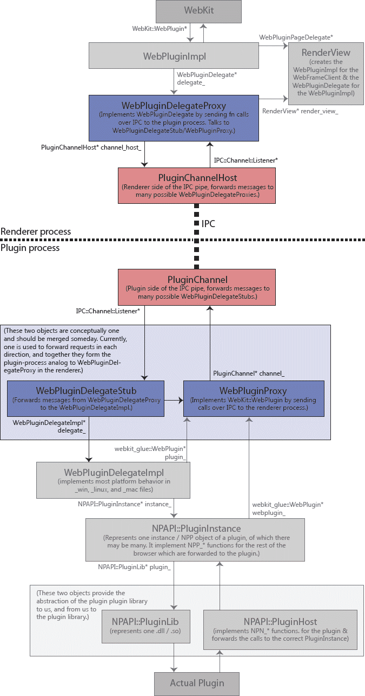
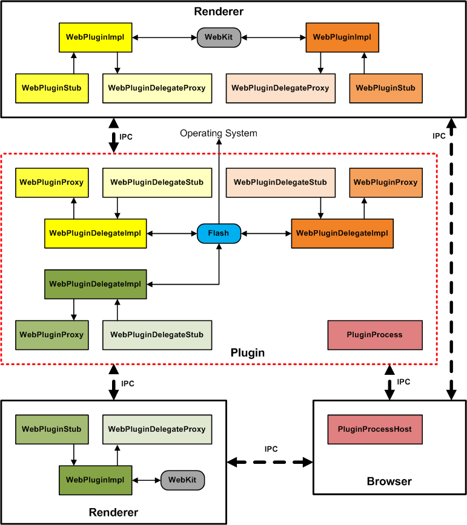

# Plugin Architecture
## Background

Before reading this document, you should be familiar with Chromium's multi-process architecture.

## Overview

Plugins are a major source of browser instability. Plugins also make sandboxing the process where the renderer runs impractical, as plugins are written by third-parties and we can't control their access to the operating system. The solution is to run plugins in their own separate process.

## Detailed design

### In-process plugins

Chromium has the ability to run plugins in process (this is handy for testing) as well as out of process. Both start at our non-multi-process-aware WebKit embedding layer, which expects the embedder to implement the WebKit::WebPlugin interface. This is implemented by WebPluginImpl. The WebPluginImpl talks "up" the chain to a WebPluginDelegate interface, which for in-process plugins is implemented by WebPluginDelegateImpl. This in turn talks to our NPAPI wrapper layer.

Historical note: Before we had the WebKit embedding layer, WebPluginImpl was the embedding layer. It would talk to the "embedding application" through the WebPluginDelegate abstract interface, which we would switch implementations of for in-process and out-of-process plugins. With the addition of the Chromium WebKit API, we added the new WebKit::WebPlugin abstract interface, which has the same function as the old WebPluginDelegate interface. A better design with this interface would be to merge WebPluginImpl and WebPluginDelegateImpl and do the process split at the WebKit::WebPlugin level. This has not been changed due to its complexity.

### Out-of-process plugins

Chromium switches out implementations at the layer indicated by the dotted line in the diagram above to support out-of-process plugins. This just interposes an IPC layer between the WebPluginImpl and WebPluginDelegateImpl layers, and lets us share all of our NPAPI code between each mode. All of the old WebPluginDelegateImpl code, as well as all of the NPAPI layer it talks to, now executes in the separate plugin process.

The two sides of a Renderer/Plugin communication channel are represented by the PluginChannel and the PluginChannelHost. We have many renderer processes, and one plugin process for each unique plugin. This means there is one PluginChannelHost in the renderer for each type of plugin it uses (for example, Adobe Flash and Windows Media Player). In each plugin process, there will be one PluginChannel for each renderer process that has an instance of that type of plugin.

Each end of the channel, in turn, maps to many different instances of a plugin. For example, if there are two Adobe Flash movies embedded in a web page, there will be two WebPluginDelegateProxies (and related stuff) in the renderer side, and two WebPluginDelegateStubs (and related stuff)
in the plugin side. The channel is in charge of multiplexing the communication between these many objects over one IPC connection.

In this diagram, you can see the classes from the above in-process diagram grayed out, with the new out-of-process layer (in color) in the middle.

**Historical note**: We used to consistently use a stub/proxy model for communication, with one stub and one proxy on each side of the IPC channel for receiving and sending messages to one plugin, respectively. This leads to many classes that can get confusing. As a result, the WebPluginStub was merged into the WebPluginDelegateProxy which now handles the renderer side of all IPC communication for one plugin instance. The plugin side has not been merged yet, leaving two classes, the WebPluginDelegateStub and the WebPluginProxy as conceptually the same object, just representing different directions of communication.

### Windowless Plugins

Windowless plugins are designed to run directly within the rendering pipeline.  When WebKit wants to draw a region of the screen involving the plugin it calls into the plugin code, handing it a drawing context.  Windowless plugins are often used in situations where the plugin is expected to be transparent over the page -- it's up to the plugin drawing code to decide how it munges the bit of the page it's given.

To take windowless plugins out of process, you still need to incorporate their rendering in the (synchronous) rendering pass done by WebKit.  A naively slow option is to clip out the region that the plugin will draw on then synchronously ship that over to the plugin process and let it draw.  This can then be sped up with some shared memory.

However, rendering speed is then at the mercy of the plugin process (imagine a page with 30 transparent plugins -- we'd need 30 round trips to the plugin process).  So instead we have windowless plugins asynchronously paint, much like how our existing page rendering is asynchronous with respect to the screen.  The renderer has effectively a backing store of what the plugin's rendered area looks like and uses this image when drawing, and the plugin is free to asynchronously send over new updates representing changes to the rendered area.

All of this is complicated a bit by "transparent" plugins.  The plugin process needs to know what pixels it wants to draw over.  So it also keeps a cache of what the renderer last sent it as the page background behind the plugin, then lets the plugin repeatedly draw over that. 

So, in all, here are the buffers involved for the region drawn by a windowless plugin:

Renderer process
 - backing store of what the plugin last rendered as
 - shared memory with the plugin for receiving updates ("transport DIB")
 - copy of the page background behind the plugin (described below)

Plugin process
 - copy of the page background behind the plugin, used as the source
material when drawing
 - shared memory with the renderer for sending updates ("transport DIB")

Why does the renderer keep a copy of the page background?  Because if the page background changes, we need to synchronously get the plugin to redraw over the new background it will appear to lag.  We can tell that the background changed by comparing the newly-rendered background against our copy of what the plugin thinks the background.  Since the plugin and renderer processes are asynchronous with respect to one another, they need separate copies.
### Overall system

This image shows the overall system with the browser and two renderer processes, each communicating with one shared out-of-process Flash process. There are three total plugin instances. Note that this diagram is out of date, and WebPluginStub has been merged with WebPluginDelegateProxy.

