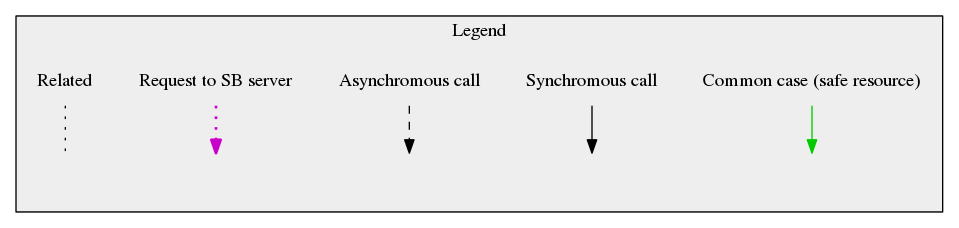
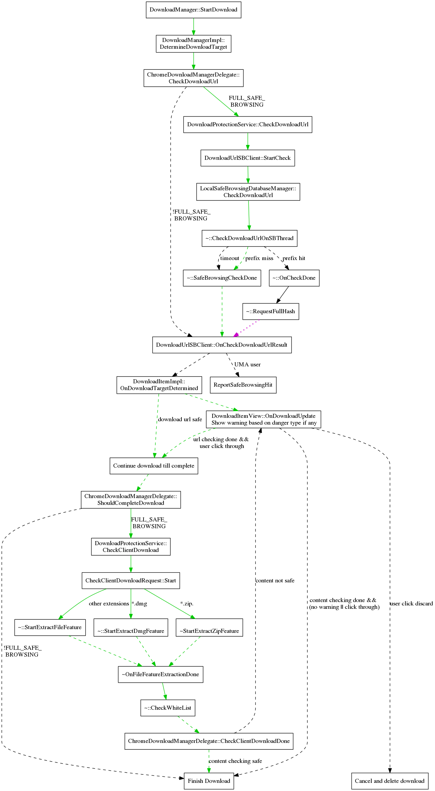

# Safe Browsing

## Browsing Protection

When Safe Browsing is enabled, all URLs will be checked before the content is allowed to begin loading.  URLs are checked against two lists: malware and phishing.  Depending on which list is matched we show a different warning message on the interstitial page.

Checking the safe browsing database is a multistep process.  The URL is hashed and a synchronous check against the in-memory prefix list is done.  If no match is found, the URL is considered safe immediately.  If the prefix matches, an asynchronous request is made to the safe browsing servers for a list of all full hashes matching that prefix.  Once the list is returned, the full hash is compared against the list and the URL request can be continued or cancelled.  For more information, you may check the full description of the Safe Browsing Protocol.
### Resource Handlers

Whenever a resource is requested, the ResourceDispatcherHost will create a chain of ResourceHandlers. For each event in the loading of the resource, each handler can choose to cancel the request, defer the request (to do some asynchronous work before deciding what to do), or continue (letting the next handler in the chain have a chance to decide). The SafeBrowsingResourceHandler is created at the head of the chain so that it has first say over whether to allow loading a resource. If safe browsing is disabled, the SafeBrowsingResourceHandler is simply not added to the chain, and thus no browsing-related safe browsing actions occur.
### Safe Browsing Interstitial Page

When a resource is marked as unsafe the resource request is paused and an interstitial page (SafeBrowsingBlockingPage) is displayed. The user can choose to continue anyway, which will resume the resource request, or to go back, which will cancel the resource request and return to the previous page. 

### Threat Details Collection

If the interstitial is for a hit in the threat list (including malware, phishing, and UwS), the page is http (not https), and the tab is not in an incognito window, there is an opt-in option to send extra details about the the unsafe resources for further analysis.

When the interstitial appears an IPC is sent to the renderer process to collect details from the DOM. The data consists of a tree of the URLs for the various frames, iframes, scripts and embeds.

If the checkbox is checked when the user chooses dismisses the interstitial page, various extra details will be collected asynchronously on the browser side. First the History service is queried to get the list of redirects involved in all the URLs, then the Cache is queried to get the headers for each of the requests for those URLs, and finally the report will be sent.
## Download Protection

### URL Checking

The download checks operate in a similar manner to the browsing ones, though with some changes due to the different nature of downloads.  It is not known that a resource request will be a download until the headers are received, therefore all downloads also go through the browsing checks.  For the same reason, we cannot check the redirect URLs as we go along like is done in the browsing tests.  Instead the chain of redirects is saved in the URLRequest object and once we begin the download checks, all the URLs in the chain will be checked simultaneously.  Since downloads are less latency sensitive than page loads, we also dispense with the in-memory database and the caching of full hash results.  Finally, the check is done in parallel to the download rather than pausing the download request until the checks are done, however the file will be given a temporary name until the checks complete.
If a download is flagged as malicious, the item in the download bar will be replaced with a warning and buttons to keep or discard the file.  If discard is chosen, the request will be cancelled and the file deleted. If the file is kept, it will be renamed to its actual name (with .crdownload if the download is still in progress). 

### Hash Checking

As the file downloads, we also compute a hash of the file data.  Once the file has completed downloading this hash is checked against the download digest list.  Currently we are evaluating the usefulness of the hash check so no UI is displayed.

This is an overview of the code flow of handling a download.  Some details are omitted to keep the size reasonable. This is an overview of the code flow of handling a request.  Some details are omitted to keep the size reasonable.  The green line indicates the common case where loading a non-malware page only requires a synchronous check to the in-memory safe browsing database.  The dashed lines indicate asynchronous calls.  The dotted magenta lines indicates a request to Google's Safe Browsing server.

## Client Side Phishing Detection

Client Side Phishing Detection runs a detection model on pages the user visits to try to detect phishing pages that are not in the safe browsing lists.  On startup, and periodically afterwards, the ClientSideDetectionService will fetch an updated model.  The model is sent in an IPC to every Render Process, then assigned to PhishingClassifierDelegate associated with each RenderView.   This allows the classification to be done in the render process, which has access to the page text.

## Resource Request Flow

This is an overview of the code flow of handling a request.  Some details are omitted to keep the size reasonable.  The green line indicates the common case where loading a non-malware page only requires a synchronous check to the in-memory safe browsing database.  The dashed lines indicate asynchronous calls.  The dotted magenta lines indicates a request to Google's Safe Browsing server.

Safe Browsing Resource Request Diagram

## Metrics

Safe browsing histograms use the "SB2." prefix.  Histograms for older versions used "SB.".  There are also a few safe browsing UserMetrics (filter on "SB"), and safe browsing Rappor metrics (starts with "interstitial").

## Safe Browsing Database

The SafeBrowsingService is responsible for updating the various databases used by safe browsing.
TODO(mattm): provide more details about database format and update process.