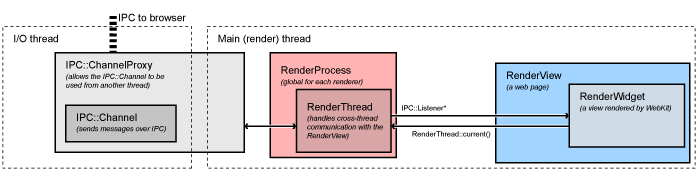

# How Chromium Displays Web Pages
This document describes how web pages are displayed in Chromium from the bottom up. Be sure you have read the [multi-process architecture](Multi-process_Architecture.md) design document. You will especially want to understand the block diagram of major components. You may also be interested in [multi-process resource loading](General_Architecture/Multi-process_Resource_Loading.md) for how pages are fetched from the network.

## Conceptual application layers

(The original Google Doc for this illustration is http://goo.gl/MsEJX which is open for editing by any @chromium.org)

Each box represents a conceptual application layer. No layer should have knowledge of or dependencies on any higher-level layers.
- WebKit: Rendering engine shared between Safari, Chromium, and all other WebKit-based browsers. The Port is a part of WebKit that integrates with platform dependent system services such as resource loading and graphics.

- Glue: Converts WebKit types to Chromium types. This is our "WebKit embedding layer." It is the basis of two browsers, Chromium, and test_shell (which allows us to test WebKit).

- Renderer / Render host: This is Chromium's "multi-process embedding layer." It proxies notifications and commands across the process boundary.

- WebContents: A reusable component that is the main class of the Content module. It's easily embeddable to allow multiprocess rendering of HTML into a view. See the [content module pages](Other/content_module___content_API.md) for more information.

- Browser: Represents the browser window, it contains multiple WebContentses.

- Tab Helpers: Individual objects that can be attached to a WebContents (via the WebContentsUserData mixin). The Browser attaches an assortment of them to the WebContentses that it holds (one for favicons, one for infobars, etc).

## WebKit

We use the WebKit open-source project to lay out web pages. This code is pulled from Apple and stored in the /third_party/WebKit directory. WebKit consists primarily of "WebCore" which represents the core layout functionality, and "JavaScriptCore" which runs JavaScript. We only run JavaScriptCore for testing purposes, normally we replace it with our high performance V8 JavaScript engine. We do not actually use the layer that Apple calls "WebKit," which is the embedding API between WebCore and OS X applications such as Safari. We normally refer to the code from Apple generically as "WebKit" for convenience.

### The WebKit port

At the lowest level we have our WebKit "port." This is our implementation of required platform-specific functionality that interfaces with the platform-independent WebCore code. These files are located in the WebKit tree, typically in chromium directories or as Chromium-suffixed files. Much of our port is not actually OS-specific: you could think of it as the "Chromium port" of WebCore. Some parts, like font rendering, must be handled differently for each platform.

- Network traffic is handled by our [multi-process resource loading](General_Architecture/Multi-process_Resource_Loading.md) system rather than being handed off to the OS directly from the render process.
- Graphics uses the Skia graphics library developed for Android. This is a cross-platform graphics library and handles all images and graphics primitives except for text. Skia is located in /third_party/skia. The main entrypoint for graphics operations is /webkit/port/platform/graphics/GraphicsContextSkia.cpp. It uses many other files in the same directory as well as from /base/gfx.

### The WebKit glue

The Chromium application uses different types, coding styles, and code layout than the third-party WebKit code. The WebKit "glue" provides a more convenient embedding API for WebKit using Google coding conventions and types (for example, we use std::string instead of WebCore::String and GURL instead of KURL). The glue code is located in /webkit/glue. The glue objects are typically named similar to the WebKit objects, but with "Web" at the beginning. For example, WebCore::Frame becomes WebFrame.
The WebKit "glue" layer insulates the rest of the Chromium code base from WebCore data types to help minimize the impact of WebCore changes on the Chromium code base. As such, WebCore data types are never used directly by Chromium. APIs are added to the WebKit "glue" for the benefit of Chromium when it needs to poke at some WebCore object.

The "test shell" application is a bare-bones web browser for testing our WebKit port and glue code. It uses the same glue interface for communicating with WebKit as Chromium does. It provides a simpler way for developers to test new code without having many complicated browser features, threads, and processes. This application is also used to run the automated WebKit tests. However, the downside of the "test shell" is that it doesn't exercise WebKit as Chromium does, in a multi-process way. The content module is embedded in an application called "content shell" which will soon be running the tests instead.

## The render process

Chromium's render process embeds our WebKit port using the glue interface. It does not contain very much code: its job is primarily to be the renderer side of the [IPC](General_Architecture) channel to the browser..
The most important class in the renderer is the RenderView, located in /content/renderer/render_view_impl.cc. This object represents a web page. It handles all navigation-related commands to and from the browser process. It derives from RenderWidget which provides painting and input event handling. The RenderView communicates with the browser process via the global (per render process) RenderProcess object.

**FAQ: What's the difference between RenderWidget and RenderView?** RenderWidget maps to one WebCore::Widget object by implementing the abstract interface in the glue layer called WebWidgetDelegate.. This is basically a Window on the screen that receives input events and that we paint into. A RenderView inherits from RenderWidget and is the contents of a tab or popup Window. It handles navigational commands in addition to the painting and input events of the widget. There is only one case where a RenderWidget exists without a RenderView, and that's for select boxes on the web page. These are the boxes with the down arrows that pop up a list of options. The select boxes must be rendered using a native window so that they can appear above everything else, and pop out of the frame if necessary. These windows need to paint and receive input, but there isn't a separate "web page" (RenderView) for them.

### Threads in the renderer

Each renderer has two threads (see the [multi-process architecture](Multi-process_Architecture.md) page for a diagram, or [threading in Chromium](General_Architecture/Threading.md) in Chromium for how to program with them). The render thread is where the main objects such as the RenderView and all WebKit code run. When it communicates to the browser, messages are first sent to the main thread, which in turn dispatches the message to the browser process. Among other things, this allows us to send messages synchronously from the renderer to the browser. This happens for a small set of operations where a result from the browser is required to continue. An example is getting the cookies for a page when requested by JavaScript. The renderer thread will block, and the main thread will queue all messages that are received until the correct response is found. Any messages received in the meantime are subsequently posted to the renderer thread for normal processing.
## The browser process

### Low-level browser process objects

All [IPC](General_Architecture) communication with the render processes is done on the I/O thread of the browser. This thread also handles all [network communication](Multi-process_Resource_Loading.md) which keeps it from interfering with the user interface.

When a RenderProcessHost is initialized on the main thread (where the user interface runs), it creates the new renderer process and a ChannelProxy [IPC](General_Architecture) object with a named pipe to the renderer. This object runs on the I/O thread of the browser, listening to the named pipe to the renderer, and automatically forwards all messages back to the RenderProcessHost on the UI thread. A ResourceMessageFilter will be installed in this channel which will filter out certain messages that can be handled directly on the I/O thread such as network requests. This filtering happens in ResourceMessageFilter::OnMessageReceived.

The RenderProcessHost on the UI thread is responsible for dispatching all view-specific messages to the appropriate RenderViewHost (it handles a limited number of non-view-specific messages itself). This dispatching happens in RenderProcessHost::OnMessageReceived.

### High-level browser process objects

View-specific messages come into RenderViewHost::OnMessageReceived. Most of the messages are handled here, and the rest get forwarded to the RenderWidgetHost base class. These two objects map to the RenderView and the RenderWidget in the renderer (see "The Render Process" above for what these mean). Each platform has a view class (RenderWidgetHostView[Aura|Gtk|Mac|Win]) to implement integration into the native view system.

Above the RenderView/Widget is the WebContents object, and most of the messages actually end up as function calls on that object. A WebContents represents the contents of a webpage. It is the top-level object in the content module, and has the responsibility of displaying a web page in a rectangular view. See the [content module pages](Other/content_module___content_API.md) for more information.

The WebContents object is contained in a TabContentsWrapper. That is in chrome/ and is responsible for a tab.

## Illustrative examples

Additional examples covering navigation and startup are in [Getting Around the Chromium Source Code](https://www.chromium.org/developers/how-tos/getting-around-the-chrome-source-code).
### Life of a "set cursor" message

Setting the cursor is an example of a typical message that is sent from the renderer to the browser. In the renderer, here is what happens.

- Set cursor messages are generated by WebKit internally, typically in response to an input event. The set cursor message will start out in RenderWidget::SetCursor in content/renderer/render_widget.cc.

- It will call RenderWidget::Send to dispatch the message. This method is also used by RenderView to send messages to the browser. It will call RenderThread::Send.

- This will call the IPC::SyncChannel which will internally proxy the message to the main thread of the renderer and post it to the named pipe for sending to the browser.

Then the browser takes control:

- The IPC::ChannelProxy in the RenderProcessHost receives all message on the I/O thread of the browser. It first sends them through the ResourceMessageFilter that dispatches network requests and related messages directly on the I/O thread. Since our message is not filtered out, it continues on to the UI thread of the browser (the IPC::ChannelProxy does this internally).

- RenderProcessHost::OnMessageReceived in content/browser/renderer_host/render_process_host_impl.cc gets the messages for all views in the corresponding render process. It handles several types of messages directly, and for the rest forwards to the appropriate RenderViewHost corresponding to the source RenderView that sent the message.

- The message arrives at RenderViewHost::OnMessageReceived in content/browser/renderer_host/render_view_host_impl.cc. Many messages are handled here, but ours is not because it's a message sent from the RenderWidget and handled by the RenderWidgetHost.

- All unhandled messages in RenderViewHost are automatically forwarded to the RenderWidgetHost, including our set cursor message.

- The message map in content/browser/renderer_host/render_view_host_impl.cc finally receives the message in RenderWidgetHost::OnMsgSetCursor and calls the appropriate UI function to set the mouse cursor.

### Life of a "mouse click" message

Sending a mouse click is a typical example of a message going from the browser to the renderer.

- The Windows message is received on the UI thread of the browser by RenderWidgetHostViewWin::OnMouseEvent which then calls ForwardMouseEventToRenderer in the same class.

- The forwarder function packages the input event into a cross-platform WebMouseEvent and ends up sending it to the RenderWidgetHost it is associated with.

- RenderWidgetHost::ForwardInputEvent creates an IPC message ViewMsg_HandleInputEvent, serializes the WebInputEvent to it, and calls RenderWidgetHost::Send.

- This just forwards to the owning RenderProcessHost::Send function, which in turn gives the message to the IPC::ChannelProxy.

- Internally, the IPC::ChannelProxy will proxy the message to the I/O thread of the browser and write it to the named pipe of the corresponding renderer.

Note that many other types of messages are created in the WebContents, especially navigational ones. These follow a similar path from the WebContents to the RenderViewHost.

Then the renderer takes control:

- IPC::Channel on the main thread of the renderer reads the message sent by the browser, and IPC::ChannelProxy proxies to the renderer thread.

- RenderView::OnMessageReceived gets the message. Many types messages are handled here directly. Since the click message is not, it falls through (with all other unhandled messages) to RenderWidget::OnMessageReceived which in turn forwards it to RenderWidget::OnHandleInputEvent.

- The input event is given to WebWidgetImpl::HandleInputEvent where it is converted to a WebKit PlatformMouseEvent class and given to the WebCore::Widget class inside WebKit.