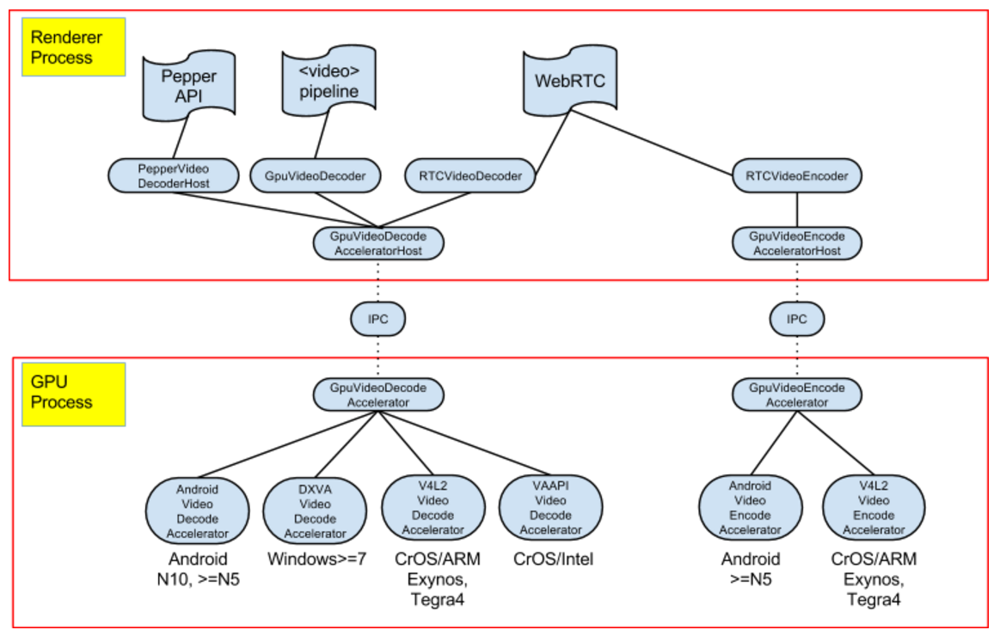

# Chrom{e,ium}{,OS}中的硬件视频加速

Ami Fischman &lt;fischman@chromium.org&gt;

Status as of 2014/06/06: Up-to-date

(可以得到更多的细节)

## 介绍

视频解码（e.g. Youtube点播）和编码（e.g. 视频聊天应用）是现代网络中最复杂的计算操作之一。将这些操作从运行在通常目的的CPU移动到指定的硬件块意味着更低的电力消耗，更长的电池寿命，更高的质量（e.g. HD而非SD），更好的交互表现（因为CPU可以被其他需要做的事情占满）。

## 设计

[media::VideoDecodeAccelerator](https://code.google.com/p/chromium/codesearch#chromium/src/media/video/video_decode_accelerator.h&q=media::VideoDecodeAccelerator&sq=package:chromium&ct=rc&cd=1&l=21&dr=Ss) (VDA) 和 [media::VideoEncodeAccelerator](https://code.google.com/p/chromium/codesearch#chromium/src/media/video/video_encode_accelerator.h&l=23) (VEA) (有他们对应的客户端子类)是Chrome中所有视频硬件加速的中心接口。每个硬件加速的消费者实现相关的客户端接口，调用一个相关的V[DE]A对象。

通常这些类想要编码或解码存在于渲染器进程中的视频（e.g.&lt;video&gt;播放器，或者WebRTC的视频解编码器），被使用的硬件在渲染器进程内是不可访问的，所以[IPC](https://code.google.com/p/chromium/codesearch#chromium/src/content/common/gpu/gpu_messages.h&q=f:messages%5C.h%20acceleratedvideo&sq=package:chromium&type=cs&l=712)被用于连接渲染器<->GPU进程。

## 实现细节

加速API的主要使用者是：&lt;video&gt;管道（在web上展示媒体信息），WebRTC（使得web上脱离插件的实时视频聊天变得可能），Pepper API（为pepper插件比如Adobe Flash提供硬件加速）。

实现硬件加速API与操作系统相关（有时候也与硬件平台相关），因为操作系统和驱动/硬件表示层提供了极度不同的各种选项。

(没有画出的部分: 过时的基于OpenMAX-IL的[OVDA](https://code.google.com/p/chromium/issues/detail?id=223194), 以及不会启动的[MacVDA](https://code.google.com/p/chromium/issues/detail?id=133828)).

## 当前状态
新的设备层出不穷，所以这个列表很可能已经过时了，但在2014年六月上旬，已有的（公开）支持包括：

**解码**
- Windows: 从Windows 7开始, h.264的硬件加速解码被用于DXVAVDA.
- CrOS/Intel (一切过去的Mario/Alex/ZGB): h.264的硬件加速解码被用于VAVDA
- CrOS/ARM: V4L2VDA可以使用h.264和VP8的硬件加速解码
- Android: 在N10， N5，和一些S4, 以及一些其他设备上， VP8的硬件加速解码可用。（注意在Android上这是用于WebRTC，因为没有PPAPI，并且&lt;video&gt;标签使用平台自己的播放器）

**Encode**
- CrOS/ARM: V4L2VEA可以使用h.264的硬件加速编码（任何地方），以及VP8（2014年的设备）
- Android: N5上可以使用VP8硬件加速编码

## 结果
一般来说，从CPU去掉编解码，转到指定的硬件上，根据平台/工作负载等的不同，可以延长电池10%-25%的寿命。一些数据例子可以在这里看：

公开:  [133827#c27](http://crbug.com/133827#c27), [219957#c16](https://code.google.com/p/chromium/issues/detail?id=219957#c16)

google内部: [summary slide deck](http://docs/presentation/d/1lhWy_gsAhDtnB5l3i2ND2rWhHgmgtV394WoVzlqevAE/edit#slide=id.g1c7d5a5cf_023), [CrOS/ARM-1](https://docs.google.com/a/google.com/spreadsheets/d/1tdAEvCVPKH6280EArYPHaE10HA0iFP0aypJGy4n26LM/edit#gid=0), [CrOS/ARM-2](http://docs/document/d/1fty8UzlwN0SzJlURfNbPysYZ1sj4VFaDpF0MV95HbNE/edit#)

