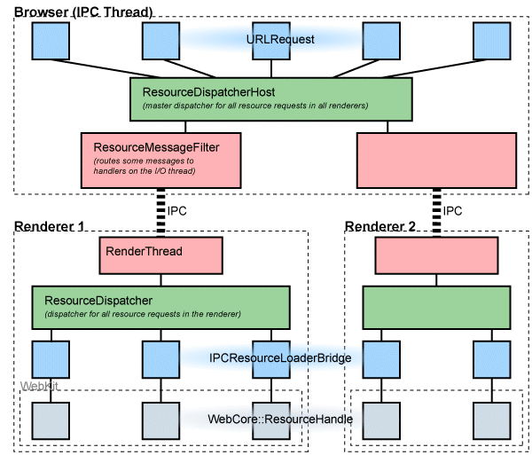

# 多进程资源加载（需要更新）

## 背景知识

所有网络交流都是在主浏览器进程处理的。这样浏览器进程不仅可以控制每个渲染器的网络访问，还可以在进程间维持session状态一致性，像cookie和缓存数据。另一个重要的原因是，作为一个HTTP/1.1的用户代理，浏览器整体上在每个host上不能打开太多连接。

## 概述

我们的多进程应用程序可以从三个层面来看。在最底层是WebKit库，用来渲染页面。在它上面是渲染器进程（简单地，每个标签页对应一个进程），每个进程包含一个WebKit实例。管理所有渲染器的是浏览器进程，控制所有的网络访问。

## Blink（刷新器）

Blink有一个ResourceLoader对象，负责获取数据。每个加载器有一个WebURLLoader以展现真实的请求。这个实例的头文件在Blink仓库中。

ResourceLoader实现了WebURLLoaderClient接口。这是渲染器使用的回调接口，用以获取数据和其他刷新用的事件。

测试shell使用一个不同的资源加载器，提供了不同的实现，即，一个非IPC版本的ResourceLoaderBridge，位于webkit/tools/test_shell/simple_resource_loader_bridge。

## 渲染器

渲染器对WebURLLoader的实现，成为WebURLLoaderImplementation，位于content/child。它使用全局的ResourceDispatcher单例对象（每个渲染器内部单例），来创建一个唯一的request ID，通过IPC转发这个request给浏览器。浏览器的响应会引用这个request ID，将其转换后，通过资源分发起返回给RequestPeer对象（WebURLRequestImpl）。

## 浏览器

浏览器中的RenderProcessHost对象从每个渲染器接收IPC请求。使用指向渲染进程host的指针（尤其是，ResourceDispatcherHost::Receiver），转发这些请求给全局的ResourceDispatcherHost，并且用渲染器生成的request ID唯一标识这些请求。

然后，每个请求会被转换成一个URLRequest对象，反过来将其转发给它内部的URLRequestJob（它实现了需要的特殊协议）.当URLRequest生成通知时，它的ResourceDispatcherHost::Receiver和request ID会被用于将通知发送给正确的RenderProcessHost，以将其发回给渲染器。因为渲染器生成的ID被保留，将所有的响应与一个特定的一开始由WebKit生成的请求关联起来成为可能。

## Cookies

所有的cookies由我们的CookieMonster对象处理，位于/net/base中。我们不会与WinInet共享cookie。这个浏览进程中的CookieMonster处理所有的网络请求，因为所有标签页之间的cookie必须相同。

页面可以通过document.cookie为一个document请求cookie。这种情况下，我们从渲染器向李兰器发送一个同步消息来请求cookie。当浏览器在处理cookie时，WebKit的工作线程会挂起。当渲染器的I/O线程接受到浏览器的响应时，它会解除这个线程挂起，然后把结果传回给JavaScript引擎。
