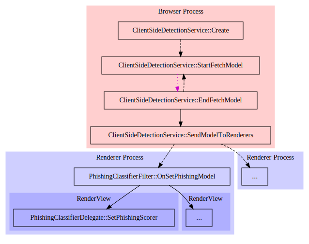
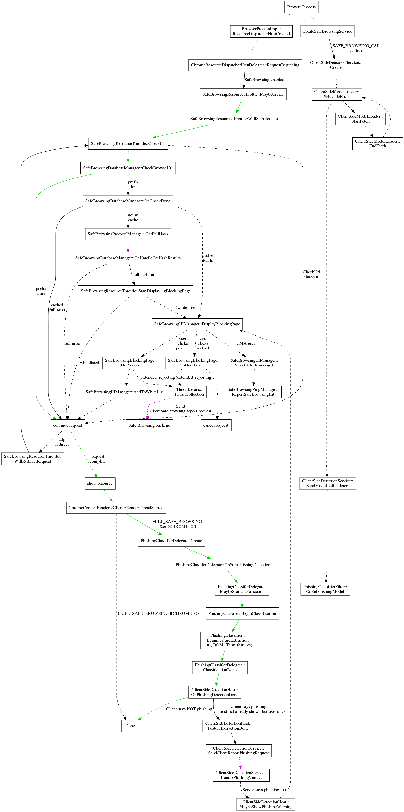

#安全浏览

##浏览保护

启动安全浏览后，在允许内容开始加载前，所有的URL都会被检查。URL通过两个列表进行检查：恶意软件和钓鱼网站。根据匹配到的列表，我们会在一个中转页面显示不同的警告页面。

检查安全浏览数据库是一个多步骤的过程。
- URL首先会被哈希，然后会用内存中前缀列表进行同步的检查。
- 如果前缀得到匹配，会向安全浏览服务器发起一个异步请求，拉取这个前缀的全量哈希列表。
- 一旦这个列表返回，完整的哈希会与列表中的每项进行比较，URL请求可以继续执行或者终止。
- 如果想要知道更多内容，你可以查看安全浏览协议的完整描述。

###资源处理器

当一个资源被请求时，ResourceDispatcherHost会创建一串的ResourceHandlers。对于加载资源时的每个事件，每个处理器可以选择取消请求，延迟请求（在决定要做的事情前，做一些异步工作），或者继续（让处理链中下一个处理器做决策）。SafeBrowsingResourceHandler在链的头部创建，所以它对于是否允许加载资源有着优先权。如果安全浏览被关闭，SafeBrowsingResourceHandler就不加入链中，因此没有浏览相关的安全浏览动作会发生。

###安全浏览中间页面

当资源被标识为不安全时，资源请求会被暂停，并展示一个中间页面（SafeBrowsingBlockingPage）。用户可以选择继续，这会唤醒资源请求，或者返回，这会取消资源请求，然后返回之前的页面。

###一些威胁细节的收集

如果中间页面是因为命中下面这些规则而展现：处于威胁列表中（包括恶意软件，钓鱼网站，以及Uws），页面是http而非https，标签页不处于一个匿名窗口中，那么会有一个可选项，让你发送关于这个不安全资源的具体细节，以进行更进一步的分析。

当中间页面出现时，一个IPC会发送给渲染器进程，从DOM收集细节。这些数据由一棵URL树组成，有各种frame，iframe，脚本，和嵌入标签。

如果用户勾选了忽视中间页面，各种具体细节会异步地在浏览器端收集。首先会查询历史服务以获得所有URL的重定向列表，然后会查询Cache以获得这些URL请求的头，最后发送一个报告。

##下载保护

###URL检查

下载检查操作与浏览页面的操作类似，尽管由于下载的本质不同会有一些差异。在接收到头之前，我们都不知道一个资源请求是否是一个下载请求，因此所有下载也会通过浏览检查。同理，我们不能检查重定向URL，因为在浏览测试中我们已经放过它了。相反，重定向链保存在一个URLRequest对象里，一旦我们开始下载检查，链中所有的URL同时会被检查。因为下载不像页面加载那样具备潜在的敏感，我们也会在内存数据库和全量哈希结果中分发要检查的内容。最后，检查与下载并行完成，而不会阻塞下载结果直到检查完成，然而直到检查完成前，文件都会被赋予一个临时的名字。

如果一个下载被标记为恶意的，下载栏的这个项目会被替换为一个警告和一个保留或删除该文件的按钮。如果选择了删除，下载会被取消，文件会被删除。如果选择了保留，文件会被重命名为它原来的名字（如果下载仍在进行，后缀会是.crdownload）。

###Hash Checking

As the file downloads, we also compute a hash of the file data.  Once the file has completed downloading this hash is checked against the download digest list.  Currently we are evaluating the usefulness of the hash check so no UI is displayed.

This is an overview of the code flow of handling a download.  Some details are omitted to keep the size reasonable. This is an overview of the code flow of handling a request.  Some details are omitted to keep the size reasonable.  The green line indicates the common case where loading a non-malware page only requires a synchronous check to the in-memory safe browsing database.  The dashed lines indicate asynchronous calls.  The dotted magenta lines indicates a request to Google's Safe Browsing server.

##Client Side Phishing Detection

Client Side Phishing Detection runs a detection model on pages the user visits to try to detect phishing pages that are not in the safe browsing lists.  On startup, and periodically afterwards, the ClientSideDetectionService will fetch an updated model.  The model is sent in an IPC to every Render Process, then assigned to PhishingClassifierDelegate associated with each RenderView.   This allows the classification to be done in the render process, which has access to the page text.

##Resource Request Flow

This is an overview of the code flow of handling a request.  Some details are omitted to keep the size reasonable.  The green line indicates the common case where loading a non-malware page only requires a synchronous check to the in-memory safe browsing database.  The dashed lines indicate asynchronous calls.  The dotted magenta lines indicates a request to Google's Safe Browsing server.

Safe Browsing Resource Request Diagram

##Metrics

Safe browsing histograms use the "SB2." prefix.  Histograms for older versions used "SB.".  There are also a few safe browsing UserMetrics (filter on "SB"), and safe browsing Rappor metrics (starts with "interstitial").

##Safe Browsing Database

The SafeBrowsingService is responsible for updating the various databases used by safe browsing.
TODO(mattm): provide more details about database format and update process.