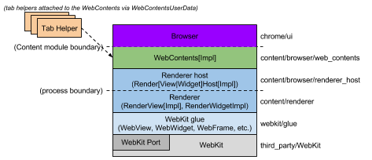

# Chromium如何展示网页

这个文档从底层描述了Chromium是如何展示网页的。请确认你已经读过[多进程架构](Multi-process_Architecture.md)这篇文章。你会特别想要了解主要组件的框架。你也可能对[多进程资源加载](General_Architecture/Multi-process_Resource_Loading.md)感兴趣，以了解网页是如何从网络中获取到的。

## 应用概念层

(关于这个阐述的原始Google文档是http://goo.gl/MsEJX，开放给所有@chromium.org的人编辑)

每个矩形代表了一个应用概念层，每一层都不了解上一层，也对上一层没有依赖。

- WebKit：Safari，Chromium和其他所有基于WebKit的浏览器共享的渲染引擎。WebKit Port是WebKit的一个部分，用来集成平台独立的系统服务，比如资源加载与图像。

- Glue：将WebKit的类型转为Chromium的类型。这就是我们的“WebKit嵌入层”。这是两个browser，Chromium，和test_shell（允许我们测试WebKit）的基础。

- Renderer / Render host： 这是Chromium的“多进程嵌入层”。它代理通知，并跨过进程边界执行指令。

- WebContents：一个可重用的组件，是内容模块的主类。它易于嵌入，允许多进程将HTML绘制成View。查看[content module pages](Other/content_module___content_API.md)以获得更多信息。

- Browser: 代表浏览器窗口，包含多个WebContent。

- Tab Helpers：可以被绑定到WebContent的独立对象（通过WebContentsUserData混杂）。浏览器将这些独立对象中的一种绑定到WebContent给它持有，一个给网站图标，一个给信息栏，等等。

## WebKit

我们使用WebKit开源工程来布局web页面。这部分代码是从Apple中pull过来的，存储在/third_party/WebKit目录。WebKit主要由“WebCore”组成，这代表了核心的布局功能，还有“JavaScriptCore”，这被用来运行JavaScript。我们只在测试时运行JavaScriptCore，通常情况下，我们用我们自己高性能的V8 Javascript引擎来代替它。事实上，我们不完全是使用Apple称之为“WebKit”的那一层，这是WebCore和OS X应用程序（比如Safari）之间的嵌入API。为了方便，我们通常把从Apple学到的代码称为“WebKit”。

### The WebKit port

在最低层，我们有我们的WebKit “port”。这是我们对于需要的平台相关功能的实现，它们与平台无关的WebCore代码交互。这些文件在WebKit树上，通常在chromium目录，或以Chromium为后缀的文件中。我们的port中的大部分其实是与操作系统无关的：你可以把它认为WebCore的“Chromium port”。但某些方面，比如字体渲染，必须在不同平台上做不同的处理。

- 网络交流由我们的[多进程资源加载](General_Architecture/Multi-process_Resource_Loading.md)系统处理，而非直接从渲染线程跳到操作系统处理
- 图像使用了为Android开发的Skia图形库。这是一个跨平台的图形库，处理所有的图形和图像，除了文本。Skia在/third_party/skia里。图形操作的主要入口是/webkit/port/platform/graphics/GraphicsContextSkia.cpp。它在这个目录里，使用了许多其他的文件，还有那些/base/gfx里的文件。

### The WebKit glue（胶水）

Chromium应用程序使用不同的类型，编码风格，以及代码布局和第三方的WebKit代码。WebKit胶水使用Google编码传统与类型为WebKit提供了一个更加方便的嵌入式API（例如，我们使用std::string而非WebCore::String，使用GURL而非KURL）。胶水代码位于/webkit/glue。glue对象通常有与WebKit对象相似的命名，但在开头有Web前缀。例如， WebCore::Frame变成了WebFrame。

WebKit胶水层将Chromium代码的其他部分与WebCore数据类型隔离开，以帮助减少WebCore的改变对Chromium代码基础的影响。因此，WebCore数据类型从不直接被Chromium使用。为了Chromium的便利，需要碰一些WebCore对象时，会把API加入WebKit的胶水层。

test shell应用程序是一个为测试我们的WebKit port和胶水代码的裸web浏览器。它在与WebKit交流时，像Chromium那样使用一样的胶水接口。它为开发者提供了简单的方式去测试新的代码，而不用理会许多复杂的浏览器特性，线程和进程。这个应用程序也被用于运行自动化WebKit测试。然而，test shell的缺点在于，它不像Chromium那样用多进程方式实践WebKit。内容模块嵌入在一个被称为“content shell”的应用程序，它很快就能用于测试工作。

## 渲染器进程

Chromium的浏览器进程使用胶水接口嵌入在我们的WebKit port中，它不包含很多代码：它的工作主要是作为渲染器端到浏览器的[IPC](General_Architecture)通道。渲染器中最重要的类是RenderView，位于/content/renderer/render_view_impl.cc。这个对象代表一个web页面。它处理与浏览器之间所有导航相关的命令。它驱动RenderWidget提供绘图和输入事件处理。

RenderView与浏览器进程通过全局（每个渲染器进程）RenderProcess对象与浏览器进程交流。

**FAQ:RenderWidget和RenderViewHost之间的区别在哪里？**RenderWidget通过在胶水层实现抽象接口（称为WebWidgetDelegate）映射到一个WebCore::Widget对象。基本一个屏幕上的window接收输入事件和我们画进去的东西。一个RenderView继承自RenderWidget，并且是一个标签页或一个填出窗口的内容。除了绘制与组件输入事件外，它还处理导航指令。只有一种情况下，RenderWidget可以在没有RenderView时存在，就是网页中的下拉选择框（select box）。下拉选择框必须用native window来渲染，这样他们可以在任何其他空间上方出现，并在必要时弹出。这些window需要绘制和接受输入，但他们没有独立的web页面（RenderView）。

### 渲染器中的线程

每个渲染器有两个线程（查看[多进程架构](Multi-process_Architecture.md)页面来查看图表，或者[threading in Chromium](General_Architecture/Threading.md)来理解如何用它们编程）。渲染线程是主要的对象，比如RenderView和所有的WebKit代码运行的地方。当它与浏览器交流时，消息一开始发送到主线程，主线程轮流分发消息给浏览器进程。在其他情况里，这允许我们从渲染器同步发送消息到浏览器。当一个来自浏览器的结果是用于后续操作时，这可以用于小量的操作。一个例子是，JavaScript从网页请求cookie。渲染器线程会阻塞，主线程会让所有的接收到的消息排队，直到得到正确的响应。此时任何接收到的消息会突然发送给渲染器线程以执行普通的处理。

## 浏览器进程

### 底层浏览器进程对象

所有的与渲染器进程交流的[IPC](General_Architecture)是在浏览器的I/O线程完成的。这个线程也处理所有的[网络交流](Multi-process_Resource_Loading.md),使得它不受用户界面的干扰。

当一个RenderProcessHost对象在主线程完成初始化（当用户界面运行时），它会创造新的渲染器进程和一个通道代理[IPC](General_Architecture)对象（有一个命名了的管道通向渲染器），自动转发所有的消息回给UI线程的RenderProcessHost。一个ResourceMessageFilter会安装在这个通道，它会过滤我们指定的消息，以直接在I/O线程处理（比如网络请求）。这个过滤器发生在ResourceMessageFilter::OnMessageReceived里。

UI线程中的RenderProcessHost负责分发所有view相关消息给合适的RenderViewHost（它自己处理有限数量的与View相关的消息）。这种分发发生在RenderProcessHost::OnMessageReceived。

### 上层浏览器进程对象

View相关消息出现在RenderViewHost::OnMessageReceived。这里处理的大部分消息，剩下的部分转发给RenderWidgetHost基类。这两个对象在渲染器里里映射到RenderView和RenderWidget（查看上面的“渲染器进程”来理解它们的含义）。每个平台有一个view类(RenderWidgetHostView[Aura|Gtk|Mac|Win])以集成到native view系统。

在RenderView/Widget上面是WebContents对象，大部分的消息事实上结束于这个对象的函数调用。一个WebContent代表网页的内容。它是内容模块的顶层对象，并且负责在一个矩形的view中展示网页。查看[内容模块页面](Other/content_module___content_API.md)获取更多信息。

WebContents对象包含在一个TabContentsWrapper中，它位于chrome/。负责标签页。

## 说明样例

额外的例子（包含了导航和启动相关代码）在[Getting Around the Chromium Source Code](https://www.chromium.org/developers/how-tos/getting-around-the-chrome-source-code)里。

### “设置光标”消息的生命周期

设置光标是一个渲染器发往浏览器的典型消息的例子。在渲染器端，以下是发生的事情：

- 设置光标消息由WebKit内部生成，通常是作为输入事件的响应。设置光标消息开始于 content/renderer/render_widget.cc中的RenderWidget::SetCursor。

- 它会调用RenderWidget::Send来分发消息。这个方法也用于RenderView向browser分发消息。它会调用 RenderThread::Send.

- 这会调用IPC::SyncChannel，它在内部代理消息到渲染器的主线程，并将其发送给命名的管道以发送给浏览器。

然后浏览器获得了控制权：

- RenderProcessHost中的IPC::ChannelProxy通过浏览器的I/O线程接收所有的消息。它首先把他们通过ResourceMessageFilter（它在I/O线程上直接分发网络请求与相关的消息）发送出去。由于我们的消息没有被过滤掉，它继续发送到浏览器的UI线程（IPC::ChannelProxy在内部完成这个事情）。
  
  content/browser/renderer_host/render_process_host_impl.cc中的RenderProcessHost::OnMessageReceived为所有的View在对应的渲染进程获取消息。它直接处理几种消息，并把剩下的部分转发到合适的与发送消息的源RenderView对应的RenderViewHost。
  
  消息到达content/browser/renderer_host/render_view_host_impl.cc中的RenderViewHost::OnMessageReceived。许多消息是在这里处理的，但我们这时的消息不是，因为它是一个从RenderWidget来，由RenderWidgetHost处理的消息。

  RenderViewHost中所有未处理的消息自动转发给了RenderWidgetHost，包括我们的设置光标消息。

  这个映射到content/browser/renderer_host/render_view_host_impl.cc的消息最终在RenderWidgetHost::OnMsgSetCursor接收到消息，并调用合适的UI函数来设置鼠标的光标。

### “鼠标点击”消息的生命周期

发送一个鼠标点击是一个经典的浏览器到渲染器的例子。

- Windows消息在浏览器的UI线程被RenderWidgetHostViewWin::OnMouseEvent接收，然后在同一个类中调用ForwardMouseEventToRenderer。
  
- 转发函数打包输入时间为一个跨平台的WebMouseEvent，最后把它发送到它所关联的RenderWidgetHost.

- RenderWidgetHost::ForwardInputEvent创建一个IPC消息ViewMsg_HandleInputEvent，将这个WebInputEvent对象序列化进去，然后调用RenderWidgetHost::Send。

- 这只是转发到自己的RenderProcessHost::Send函数，它会轮流将消息发送给IPC::ChannelProxy。

- 在内部，IPC::ChannelProxy会将消息代理到浏览器的I/O线程，将它写入渲染器对应的命名管道。

注意，许多种消息创建于WebContents，特别是导航类的消息。这些消息遵循一个相似的从WebContents到RenderViewHost的路径。

然后渲染器得到了控制权：

- 渲染器主线程的IPC::Channel读取浏览器发送的消息，然后IPC::ChannelProxy将消息代理到渲染线程。

- RenderView::OnMessageReceived拿到这个消息。许多种消息在这里直接处理。由于点击事件不是，它继续往下走（和其他所有没有被处理的消息一起）到RenderWidget::OnMessageReceived，它会轮流把消息转发给RenderWidget::OnHandleInputEvent。

- 输入事件被交给WebWidgetImpl::HandleInputEvent，在这里它被转换成一个WebKit PlatformMouseEvent类，然后交给WebKit内的WebCore::Widget类。
